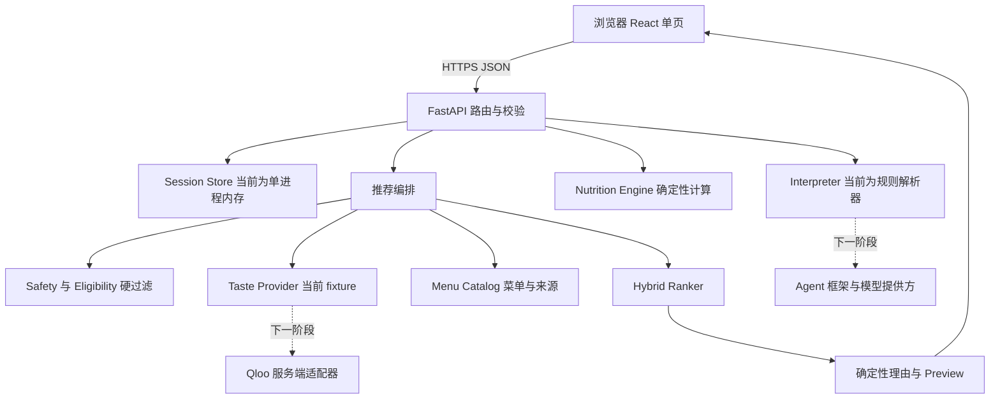

# TasteTwin 网站架构与今天的开发范围

今天的交付是可本地运行的前后端框架：React + TypeScript + Vite 负责页面，Python + FastAPI 负责结构化需求、会话、确定性营养计算、安全过滤和排序。先用明确标注的虚构数据跑通主流程，之后逐个替换真实服务。目标部署为 Vercel 前端 + Render 后端。

## 设计资料的取舍

三份资料是需求素材，不是对开发环境、账户或发布操作的授权。以下是本次建议采用的开发基线。

| 资料 | 采用内容 | 有冲突时的处理 |
| --- | --- | --- |
| PRD v1.0 | 产品价值、文化口味与营养的分工、来源与过敏边界 | 多页面、档案、长期学习延后 |
| PRD v1.2 | 工具职责、错误恢复、Qloo 证据、公开 Demo 验收 | 旧蛇形命名接口和旧权重不混入新接口 |
| 输入输出规格 v3.0 | 输入→确认→推荐→修正→选择；三种 dataMode；Preview 字段 | 本次主流程优先采用它，需团队最终冻结 |
| index.html | 了解原型页面和交互意图 | 其中写死推荐、口味分数、七日健康变化不当成实现 |
| 用户提供的 PNG | 品牌氛围：像素厨房、自然绿色与温暖背景 | 作为首页素材，使用权由团队在公开提交前核实 |

v3.0 明确允许调整视觉和布局，所以框架采用单页连续流程，避免四个独立入口之间的数据割裂。旧稿存在“无强制线性解锁”和新稿“先确认再搜索”的差异；这里的确认是保护本次查询准确性的步骤，不是功能付费或账号解锁。

营养示例也有冲突：42/65≈0.646，按 0.70/0.90 阈值应为 high_gap；部分示例标 medium。代码以确定性公式为准。排序采用 v3.0 建议权重，放在 ranking.py 中，不混用 v1.2 的四项权重。

## 系统边界

### 前端

页面只负责输入、确认、请求状态、来源标识、展示推荐和用户选择。排序、营养计算、过敏规则不写在 React。当前 TypeScript 类型在 src/types.ts，API 调用封装在 api.ts，餐食行与五项事实展示单独成组件。

状态为 START → PARSING → CONFIRM → SEARCHING → RESULTS → REFINING → REFINED → SELECTED。空结果作为 RESULTS/REFINED 的内容状态，错误作为保留上一安全状态的面板。所有异步操作使用按钮禁用和同步锁；超时 15 秒，可重试或修改。

### FastAPI

models.py 定义入参验证；main.py 负责统一成功/错误外壳、requestId、路由与会话；parser.py 解释文字并输出确认；nutrition.py 计算配置目标缺口；ranking.py 负责资格过滤和排名；catalog.py 只存虚构 fixture；qloo.py 定义口味服务接口和未启用的 live 扩展位置。

日志仅记录 requestId、方法、路径、状态和耗时，不输出完整健康输入。Qloo 边界只允许 cuisine、ambience、city，下一阶段扩展实体/标签与授权位置；不接收营养、过敏、身高体重或原始整句消息。

### 会话与数据库

今天无需数据库和登录。会话用浏览器随机 UUID 标识，在单个 FastAPI 进程内保存解析结果、同一候选池、排名和选择。没有跨设备同步；进程重启后消失；默认 1 小时有效；重新开始调用 DELETE 删除。必须维持单 worker / 单实例；多实例和长期保存之前替换为 Redis 或 PostgreSQL 并增加用户身份和删除策略。

## 接口合同

| 接口 | 本次输入 | 本次输出 | 行为 |
| --- | --- | --- | --- |
| GET /api/health | 无 | parser / qloo / menuCatalog / persistence 状态 | 如实报告未连接能力 |
| POST /api/interpret | sessionId、message、locale、location、dailySummary、allergens | confirmationText、constraints、nutritionGap、needsClarification、parserMode | 保存结构化约束，要求用户核对 |
| POST /api/recommend | sessionId、qlooEnabled、limit | recommendations、dataMode、candidateSource、comparison、trace | 使用会话中已确认的条件 |
| POST /api/refine | sessionId、refinement | appliedChanges、更新约束、Top 2 | 在现有条件上更近/便宜/不辣 |
| POST /api/select | sessionId、candidateId | recommendation、preview、twinMessage | 仅可选择当前可见结果，保持数值一致 |
| DELETE /api/sessions/{id} | sessionId | deleted | 删除本次演示会话 |

相对 v3.0 的明确调整：recommend/refine 不接受客户端重复传 nutritionGap、constraints、candidateIds，改为服务端会话持有，避免未确认条件覆盖。interpret 新增显式 allergens 字段用于补足规则解析的限制。这个变更属于框架建议，应与团队一起冻结；不是声称逐字实现了所有 P0 合同。

返回 {ok, requestId, data, warnings} 或 {ok:false, requestId, error:{code,message,retryable}}。请求字段由 Pydantic 验证；浏览器 /docs 可交互查看，/openapi.json 可下载。前端响应类型目前手工维护；真实集成之前增加完整响应模型和 OpenAPI 类型生成，避免两边漂移。

## 算法与来源

过敏冲突先删除；有过敏限制时未知成分也删除。预算、距离、菜系、氛围和辣度条件必须满足。空结果不会自动放宽条件。

nutritionMatch=min(餐食对应营养贡献 / 当前缺口, 1)。无营养数据或水分主缺口暂不计餐食营养分；水分推荐需下一阶段补饮品数据。口味 ON：0.45 nutrition + 0.35 taste + 0.20 convenience；OFF：0.70 nutrition + 0.30 convenience。并列用步行、价格、稳定 ID 排序。

当前 fixtureTasteOrder 是人工设置的演示顺序，不能当 Qloo 输出。tasteFit 标签也标 fixture，OFF 为 unavailable。开关使用同一候选集，comparison 返回完整 ON/OFF ID 序列，不另外准备两套推荐数组。Baseline 结果仍显示 candidateSource=fixture。

## 从 fixture 到真实 Qloo

1. 在团队账户中核验 API base URL、可用 endpoint、权限、限流和真实响应结构；通过服务端环境变量提供密钥。
2. 把自然语言中的菜系/文化兴趣解析为 Qloo 实体或标签 ID，建立实际 search / tag resolution / insights 链路。
3. 只允许白名单口味和地点信号传到 Qloo；加有界超时、重试、限流、标准化错误和脱敏证据。
4. 通过真实 qlooEntityId 关联经核验的 MenuCatalog。没有菜单时只展示地点；价格、营养、距离缺失必须为 null。禁止用虚构 Sora/Mori/Hana 菜单匹配真实地点。
5. 为实际位置和菜单建立来源、observedAt、estimated/official/fixture 标签；步行采用地图或经纬度估算并标估算。
6. 缓存真实候选池，ON/OFF 只重新计算相同池的排名；证明 Qloo 的信号进入结果。
7. 再选 Agent 框架与模型提供方，调用 nutrition_gap、qloo_search、rank_meals 等真实工具。规则解析器保留为透明 fallback。

## 部署分工

Vercel 只部署 apps/web 静态构建；Render 部署 apps/api FastAPI。浏览器直接请求 Render HTTPS API，CORS 用明确 Vercel origin。前端环境变量仅 VITE_API_BASE_URL；服务端密钥永不使用 VITE_ 前缀。

仓库根目录的 render.yaml 是后端 Blueprint。Vercel 项目 Root Directory 设 apps/web；构建命令 npm run build（或仓库 workspace 命令），输出 dist。apps/web/vercel.json 提供 SPA 回退。

今天未创建云资源、未发布，也未建立公开仓库。部署前需要真实账户地址、公开访问验证、英文主流程、资产许可确认和真实 Qloo 证据。云平台配置以官方文档和账户当前设置为准。

## 分阶段实施

| 阶段 | 交付与验收 |
| --- | --- |
| 今天框架 | 本地 UI + FastAPI；确认 / Top 3 / refine Top 2 / Preview；fixture 开关；错误、空态；单元与接口测试；部署配置 |
| 下一阶段数据 | 真实 Qloo 响应、ID 映射、菜单来源、服务端 secrets、错误降级、真实 A/B |
| 下一阶段 Agent | 确认框架与提供方；结构化输出与工具轨迹；未知需求澄清；显式过敏数据校验 |
| 发布与演示 | Render + Vercel；公开无登录访问；英文流程、LICENSE、源代码、录屏和脱敏 API 证据 |
| 延后 | Profile、餐食日志、历史学习、拍照、房间好友、复杂动画 |

## 数字伙伴视觉

采用用户补充的星露谷氛围：原创 32×40 网格的像素农场小人、奶油色上衣、绿色围裙、木框与田园背景。PixelTwin.tsx 用 SVG 整数坐标绘制，不依赖外部图片或游戏素材。idle / thinking / happy 三个状态绑定当前流程；选择餐食后开心表情与两次轻跳，减少动态效果设置下禁用动画。前端字体仍保持清晰可读。后续可替换成相同状态接口的精灵图，不影响推荐算法。

## 当前限制

规则解析器只覆盖少量中英文关键词，不能理解任意自然语言或复杂否定；过敏字段使用英文稳定代码并要求确认。fixture 只用于 Tokyo 虚构场景。无真实 Qloo、LLM、Agent 框架、地图、真实菜单或营养来源。没有完成 live 401/429/超时测试。当前工具轨迹仅代表确定性后端函数。部署配置尚未实际云部署验证。单进程会话架构需要在扩大部署前替换。

资料中的比赛日期和资格条款在本次未成功独立核验，不作为官方结论。Devpost 链接无法通过检索工具读取。Qloo 的官方公共文档仓库可用于下一阶段 API 核验：https://github.com/qloo/docs-public 。部署参考：https://vercel.com/docs/frameworks/frontend/vite 与 https://render.com/docs/deploy-fastapi 。
